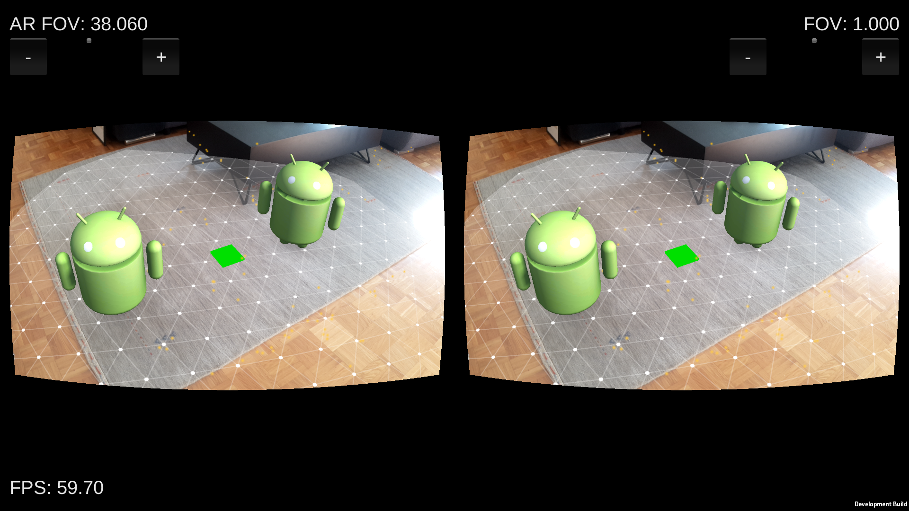

# VirtualAR

This project is a proof of concept for a see-through VR experience for mobile devices coupled with a mobile VR headset, such as Google Cardboard or similar. The VR headset needs to be modified so that the phone's camera can record the surroundings – for example, on Google Cardboard a hole needs to be cut where the phone's camera is located. After that, the VR headset can be used as if it were a see-through AR headset.

The project currently works only on Android (ARCore), with iOS support planned in the future. An example scene is included which allows the user to place a model onto the AR plane directly in front of the camera.

See Jon Dyne's blog post [Augmented Reality for Mobile VR Headsets](https://medium.com/@jon_54445/augmented-reality-for-mobile-vr-headsets-adc6d5ed11fe) for more information about the project.

## Architecture

The graphics pipeline used to render a [barrel-distorted](https://en.wikipedia.org/wiki/Distortion_(optics)) image ready to be displayed via the VR headset is as follows:

    Reality Camera → Rendering Camera → Barrel distortion → Display

The `Main` scene can be used as a reference for your own setup.

### Reality Camera

This camera is responsible for rendering the output from the device's video camera to the screen. Its render depth is set to 0, making it the first camera to be rendered. Culling mask is set to "None", since the only thing this camera renders is the video feed.

The camera has a [SeeThroughController](Assets/Scripts/SeeThroughController.cs) component attached, which is responsible for rendering the device's video feed onto a full-screen texture. It uses [SeeThroughRenderer](Assets/Scripts/SeeThroughRenderer.cs) for rendering, which is a modified version of ARFoundation's [ARBackgroundRenderer](https://docs.unity3d.com/ScriptReference/XR.ARBackgroundRenderer.html).

An important detail is that [passthrough shader](Assets/Shaders/ARCorePassthrough.shader)'s `ZWrite` setting has been turned off – the rendering camera (described below) needs to render everything on top of reality camera's output, regardless of depth.

### Rendering Camera

The rendering camera is used to render all 3D objects in the scene. Its render depth is set to 1, which makes it render after the reality camera. Clear flags have been set to "depth only" since it is being drawn on top of the reality camera's texture and it shouldn't clear it. Culling mask is set to "Everything", since this is the camera that renders the actual AR objects.

### Barrel distortion

[BarrelDistortion](Assets/Scripts/BarrelDistortion.cs) is attached to the rendering camera, and is handling the distortion of the resulting texture so that it can be viewed through the VR headset. It uses the [barrel distortion shader](Assets/Shaders/BarrelDistortion.shader) to blit the rendered output of the previous two passes while applying distortion to it. The shader is a modified version of [qian256's reference implementation](https://github.com/qian256/cardboard_seethrough).

## Usage

Open the `Main.unity` scene and build & run it on your Android device (which obviously has to support ARCore). There are two sliders (very crude at the moment, sorry) – one for controlling the FOV for the rendering camera ("AR FOV"), and one general "FOV" slider which is controlling the amount of distortion being applied to _both_ the video feed and the overlaid AR content.

In our tests we found that for a Samsung S8 "AR FOV" works best at around 38, with "FOV" at around 0.8. Fine tuning for your particular device will be needed.

## Known issues

There's currently a bug in AR Foundation which prevents videos placed in world space from being played. The screen flickers between rendering the AR scene correctly and rendering the video in fullscreen. If you have votes left on Unity's bug tracker, [please vote to get this issue fixed](https://issuetracker.unity3d.com/issues/ar-camera-does-not-work-with-video-player-on-arcore) as soon as possible.

## Planned features

* seamless switching between see-through (barrel distorted) and regular AR modes
* automatic FOV calculation based on device's camera parameters ([example](http://mathscinotes.com/2015/10/samsung-s5-field-of-view/))
* iOS support
